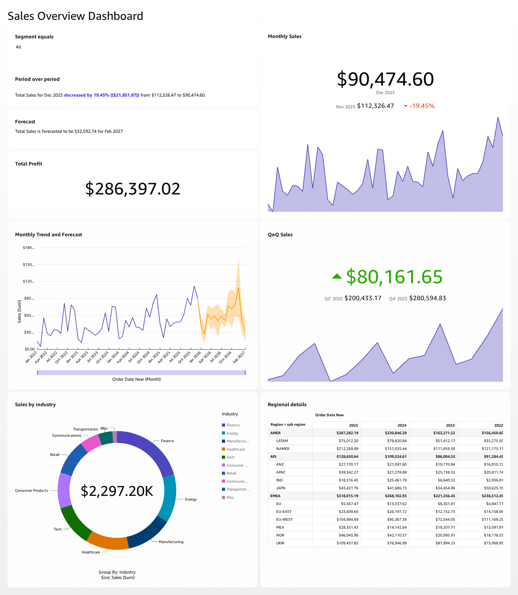

# AWS QuickSight Sales Overview Dashboard

## Project Overview

This project demonstrates an end-to-end business intelligence workflow using
Amazon S3 and Amazon QuickSight. Sales data was imported from S3, prepared in
QuickSight and visualised in an interactive dashboard.

## Dataset Source

The dataset used in this project was provided by the
[AWS QuickSight Author Workshop](https://catalog.workshops.aws/quicksight/en-US/author-workshop/1-build-your-first-dashboard/exercises). It is used here for educational and portfolio purposes. The dataset was not created by me.

## Project Scope

This project was completed largely by following the AWS QuickSight workshop as a
hands-on learning exercise. My work included:

- Connecting the workshop dataset stored in AWS S3 to Amazon QuickSight
- Reviewing and preparing the dataset
- Converting Order Date from text into a date field
- Selecting and configuring visualisations
- Adding filters and interactive controls
- Validating dashboard figures
- Publishing and email the dashboard

## Objectives

- Analyse overall sales and profitability
- Compare performance across regions and products
- Identify monthly sales trends
- Provide filters for interactive analysis

## Architecture

CSV Dataset → Amazon S3 → QuickSight Dataset → Analysis → Dashboard

## Technologies

- Amazon QuickSight
- Amazon S3
- CSV

## Dashboard



## Dashboard Features

- KPI cards for total sales and profit
- Monthly Trend and Forecast chart
- QoQ Sales chart
- Sales by region
- Filters for industry and segment
- Performance across regions

## Data Preparation

- Checked missing and duplicate records
- Converted Order Date from string to date
- Created calculated fields

## Calculated Field / data conversion

The original Order Date was stored as text:
Create a calculated field to convert to date.
```text
parseDate({Order Date}, 'MM/dd/yyyy') 

